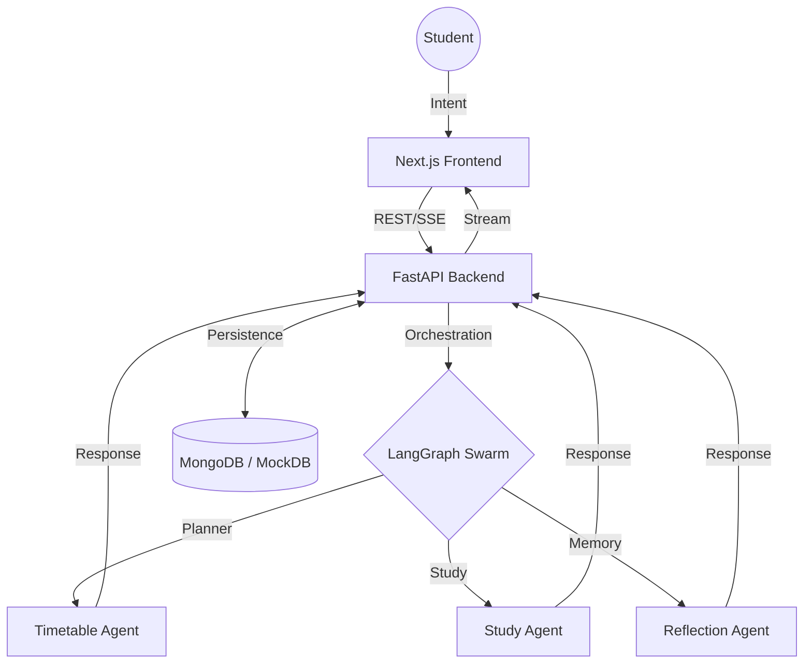

# Skillo
### Next-Generation Student Productivity & Task Orchestration
 
---

[](https://nextjs.org/)
[](https://fastapi.tiangolo.com/)
[](https://python.langchain.com/docs/langgraph)
[](https://www.mongodb.com/)

Skillo is an advanced productivity ecosystem designed specifically for academic environments. Developed as a college minor project, it integrates a distributed network of intelligent agents to automate task scheduling, study planning, and course material synthesis.

---

## The Skillo Philosophy
Current productivity applications often increase cognitive load through manual overhead. Skillo addresses this by automating the transition from raw data to actionable intent.

*   **Intent-Driven Planning**: Understands the context behind academic goals.
*   **Agentic Framework**: Leverages LangGraph for reliable, state-driven task routing.
*   **Live Pipeline Visibility**: Real-time streaming of backend decision-making processes.
*   **Operational Resilience**: Built-in algorithmic fallbacks for high-availability.

---

## System Architecture
The platform is built on a decoupled monorepo architecture, optimized for high-throughput interactions and real-time state synchronization.



### Technical Specification
| Component | Implementation | Primary Responsibility |
| :--- | :--- | :--- |
| **Orchestrator** | LangGraph | Intent classification & stateful routing |
| **Backend API** | FastAPI | Async IO management & SSE streaming |
| **Client Interface** | Next.js 14 | Responsive UI & real-time dashboard |
| **Data Layer** | MongoDB | Profile persistence & historical context |

---

---

## Deployment & Setup

### Prerequisites
*   Python 3.12+
*   Node.js 20+
*   Google Gemini API Credentials
*   MongoDB Atlas Account (Required for persistent data)

### Local Development
1. **Backend**:
   ```bash
   cd backend
   python -m venv .venv
   source .venv/bin/activate  # Windows: .venv\Scripts\activate
   pip install -r requirements.txt
   python main.py
   ```
2. **Frontend**:
   ```bash
   cd frontend
   npm install
   npm run dev
   ```

### Production Deployment

#### Backend (Render)
1. Create a new **Web Service** on [Render](https://render.com/).
2. Connect your GitHub repository.
3. Configuration:
   - **Root Directory**: `.`
   - **Runtime**: `Python`
   - **Build Command**: `pip install -r backend/requirements.txt`
   - **Start Command**: `gunicorn backend.main:app -k uvicorn.workers.UvicornWorker --bind 0.0.0.0:$PORT`
   - **Health Check Path**: `/health`
4. **Environment Variables**:
   - `GEMINI_API_KEY`: Your Google Gemini key.
   - `MONGO_URI`: Your MongoDB Atlas connection string.
   - `GOOGLE_CLIENT_ID`: Your Google OAuth Client ID.
   - `ALLOWED_ORIGINS`: `https://your-app.vercel.app` (Your Vercel URL).
   - `PINECONE_API_KEY`: (Optional) For advanced RAG features.

> [!NOTE]
> Render's free tier spins down after inactivity, causing a "cold start" delay of ~30 seconds on the first request.

#### Frontend (Vercel)
1. Import your repository into [Vercel](https://vercel.com/).
2. Set the **Root Directory** to `frontend`.
3. **Environment Variables**:
   - `NEXT_PUBLIC_API_BASE_URL`: Your Render backend URL (e.g., `https://skillo-api.onrender.com`).
   - `NEXT_PUBLIC_GOOGLE_CLIENT_ID`: Same as backend.
   - `NEXT_PUBLIC_CLASSROOM_CLIENT_ID`: Same as backend.
4. Deploy.

---

## Core Capabilities

### Distributed Intelligence
Skillo manages a coordinated group of specialized agents:
- **Planning Expert**: Optimizes daily schedules by calculating cognitive load and rest cycles.
- **Academic Analyst**: Synthesizes course materials into structured revision guides using RAG.
- **Performance Monitor**: Evaluates historical data to provide weekly productivity metrics.

### Deep Work Environment
A minimalist focus interface designed to eliminate digital distractions, featuring integrated session timers and custom application blocking.

### LMS Integration
Direct ingestion and analysis of materials from external sources like Google Classroom, allowing for immediate knowledge extraction and exam preparation.

---

## Operational Reliability
Skillo is engineered for stability in critical environments:
*   **Automatic Data Fallback**: Transitions to local JSON storage if MongoDB Atlas is unreachable.
*   **Deterministic Logic Fallback**: Switches to priority-based Python algorithms if the LLM API is unavailable.

---

<div align="center">
  <p><i>Research Project: Engineering Agentic Workflows in Ed-Tech.</i></p>
</div>
